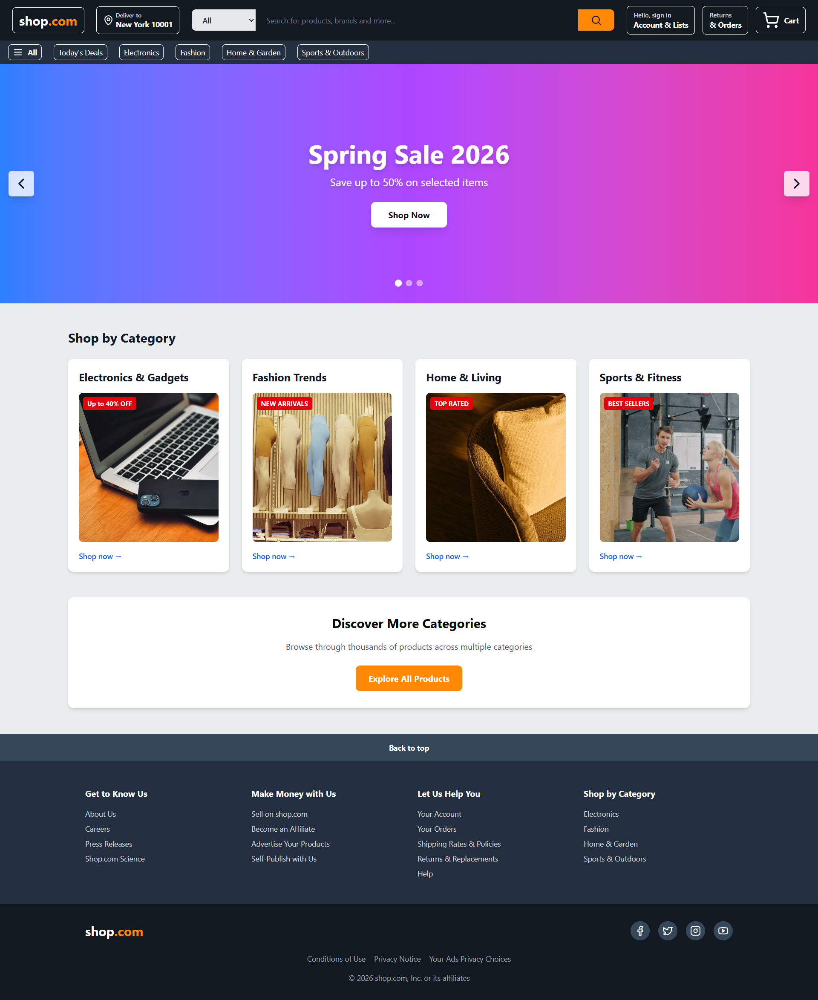
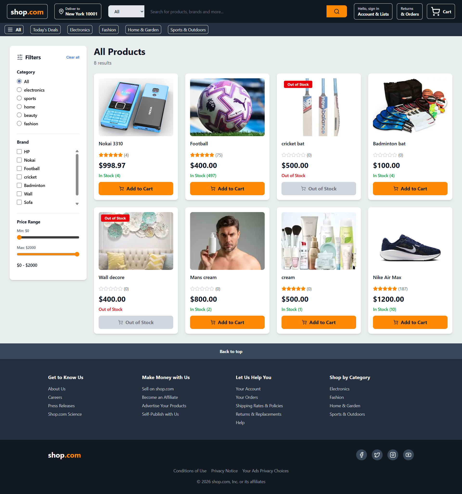
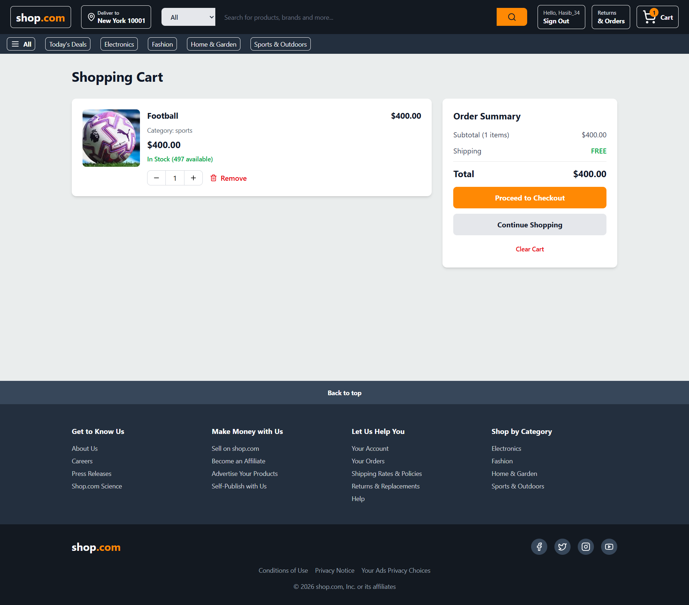
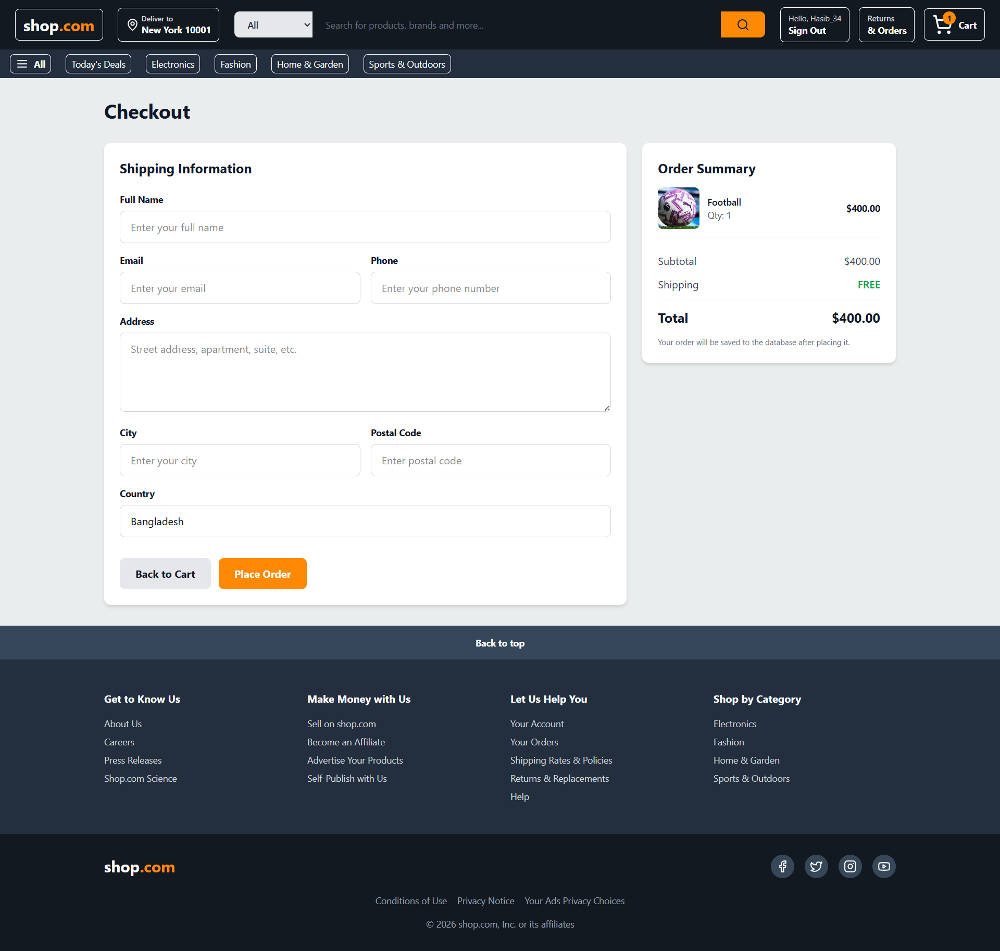
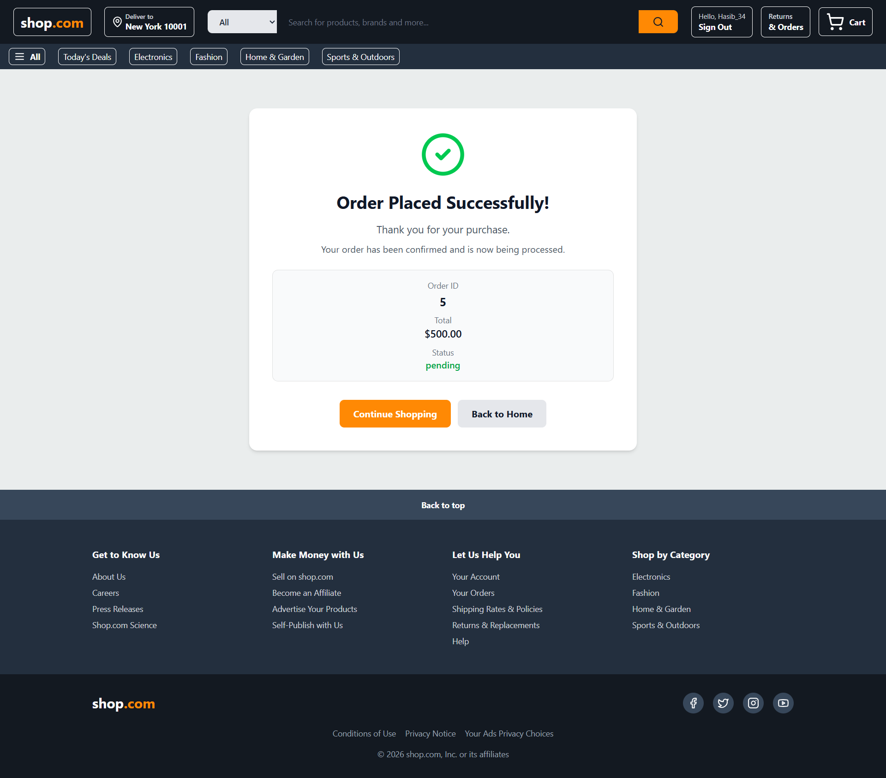
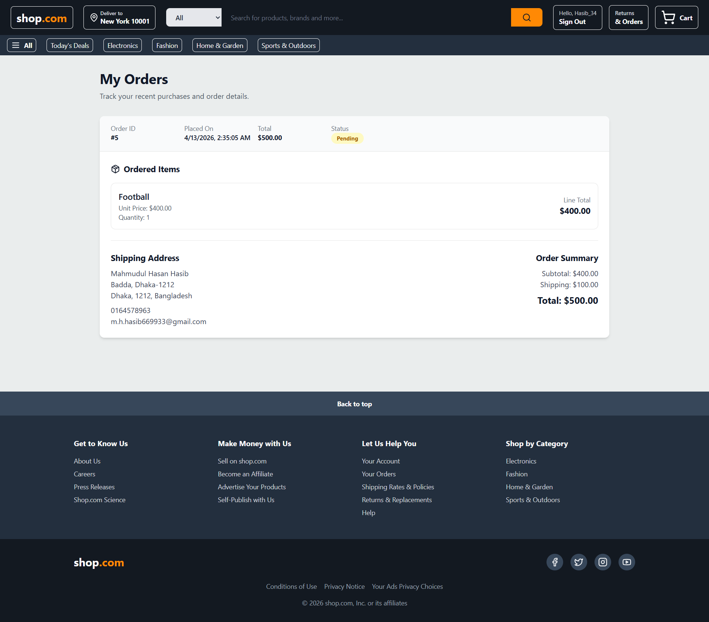
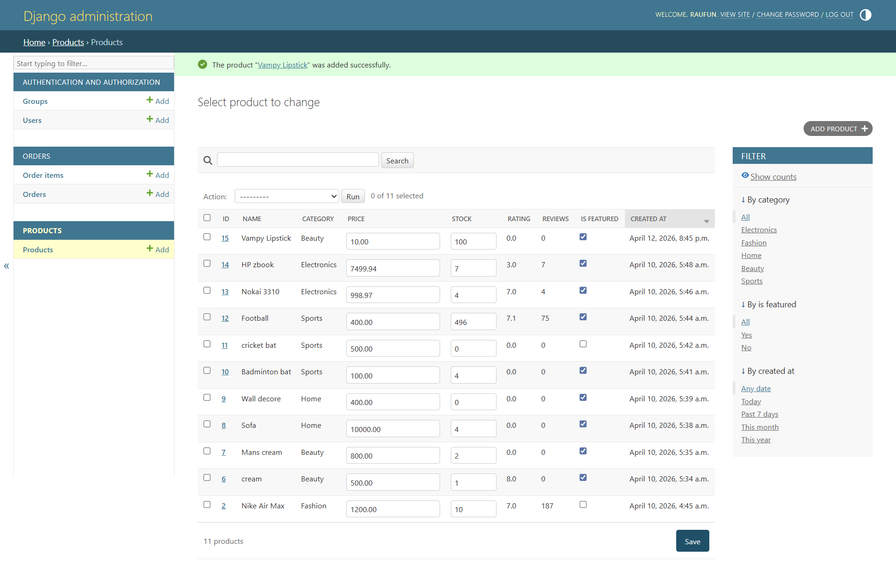

#  E-Commerce Platform (Full Stack)

A full-stack e-commerce application built with **Django REST Framework** (backend) and **React + Vite + TypeScript** (frontend).  
This project demonstrates real-world backend architecture including authentication, order management, and stock handling.

---

##  Features

###  Backend (Django REST Framework)
- Product listing API
- Product detail API
- Category-based filtering
- JWT authentication (Login / Register)
- Secure user-specific order system
- Checkout API with validation
- Order & OrderItem relational model
- My Orders API (user-specific)
- Stock validation before checkout
- Automatic stock deduction after order
- Django Admin dashboard

---

###  Frontend (React + Vite)
- Product listing page
- Product details page
- Cart management
- Checkout page
- Login & Registration
- Protected routes
- Orders page (user history)
- Order success page
- Out-of-stock UI handling
---
## 📸 Screenshots

### 🏠 Home Page


### 🛍️ Product Listing


### 📄 Product Details


### 🛒 Cart Page


### 💳 Checkout Page


### ✅ Order Success


### 📦 My Orders


### 🔧 Admin Panel

---

##  Tech Stack

### Backend
- Python
- Django
- Django REST Framework
- Simple JWT
- SQLite (local) / PostgreSQL (production)

### Frontend
- React
- TypeScript
- Vite
- Tailwind CSS
- React Router

---

##  Project Structure

```bash
E-commerce business/
├── backend/              # Django backend
│   ├── accounts/
│   ├── config/
│   ├── orders/
│   ├── products/
│   ├── manage.py
│   └── requirements.txt
├── src/                  # React frontend source
├── index.html
├── package.json
├── vite.config.ts
├── tsconfig.json
├── .env.local
└── README.md
```
---
##  Setup Instructions

###  Backend Setup

```bash
cd backend
python -m venv venv
venv\Scripts\activate
python -m pip install -r requirements.txt
python manage.py migrate
python manage.py runserver
```
---
### 🔹 Backend Runs On
 http://127.0.0.1:8000

---

### 🔹 Frontend Setup
```bash
npm install
npm run dev
```
---
### Frontend runs on:
http://localhost:5173
---
### Environment Variables

Create a .env.local file in project root:

VITE_API_BASE_URL=http://127.0.0.1:8000

##  API Endpoints

###  Authentication
| Method | Endpoint | Description |
|--------|---------|------------|
| POST | `/api/auth/register/` | Register a new user |
| POST | `/api/auth/login/` | Authenticate user and return JWT token |
| GET  | `/api/auth/me/` | Get current authenticated user |

---

###  Products
| Method | Endpoint | Description |
|--------|---------|------------|
| GET | `/api/products/` | Retrieve all products |
| GET | `/api/products/<id>/` | Retrieve product details |
| GET | `/api/products/?category=electronics` | Filter products by category |

---

###  Orders
| Method | Endpoint | Description |
|--------|---------|------------|
| POST | `/api/orders/checkout/` | Place an order |
| GET  | `/api/orders/my-orders/` | Get user's orders |
| GET  | `/api/orders/my-orders/<id>/` | Get specific order details |
---
###  Authentication

This project uses **JWT (JSON Web Token)** for secure authentication.

All protected endpoints require a valid access token in the request header:

```http
Authorization: Bearer <access_token>
```
---
### Admin Panel

Access Django admin:

http://127.0.0.1:8000/admin/
---
### Admin capabilities:

Manage products
- Update stock
- View orders
- Change order status
---
### Core Backend Logic
- Orders are linked to authenticated users
- Users can only access their own orders
- Stock is validated before order creation
- Stock is deducted after successful checkout
- Prevents ordering out-of-stock products
---
### Deployment Plan
Backend: Render
Frontend: Vercel
Database: PostgreSQL (Render)
---
### Future Improvements
- Payment integration (Stripe)
- Order tracking UI
- Product search
- Wishlist system
- Email notifications
- Image upload (Cloudinary)
---
## Author

**Mahmudul Hasan Hasib** | 
Full-stack developer focused on building scalable backend systems with Django REST Framework and dynamic frontend applications using React.